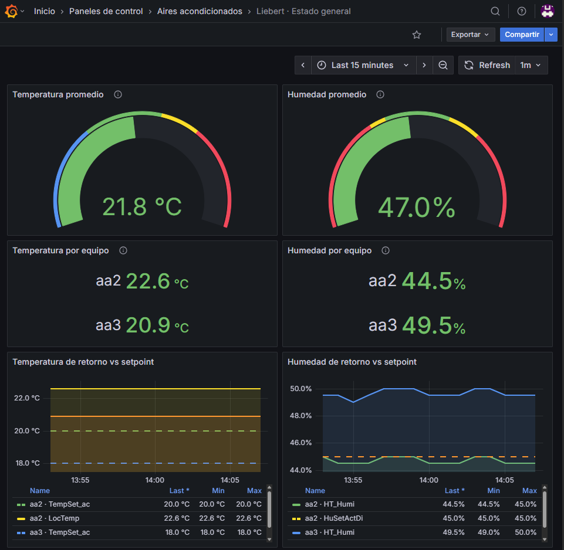

# Monitoreo Liebert / Emerson

Stack de monitoreo con Telegraf, InfluxDB 2 y Grafana. Puede recolectar desde
snapshots XML de prueba o desde unidades Liebert reales por HTTP.´



## Levantar el stack

Crear primero el archivo local de configuración a partir del ejemplo:

```bash
cp .env.example .env
```

Editar `.env` y reemplazar todas las credenciales de muestra. Luego levantar los
servicios:

```powershell
docker compose up -d
```

Abrir Grafana en <http://localhost:3000>.

- Usuario y contraseña: los valores `GRAFANA_ADMIN_USER` y
  `GRAFANA_ADMIN_PASSWORD` configurados en `.env`.
- Dashboard: **Aires acondicionados / Liebert · Estado general**

InfluxDB queda disponible en <http://localhost:8086> con las credenciales
configuradas en `.env`.

## Verificar y detener

```powershell
docker compose ps
docker compose logs -f telegraf
docker compose down
```

Los volúmenes conservan el histórico entre reinicios. Para borrar toda la base,
el histórico y la configuración persistente, y empezar de cero:

```powershell
docker compose down -v
```

## Modo simulación y modo real

El modo se elige en `.env`:

```dotenv
MONITORING_MODE=simulation
```

- `simulation`: Telegraf relee `datasets/aa1.txt`, `aa2.txt` y `aa3.txt` cada
  10 segundos. Es el valor predeterminado.
- `real`: Telegraf consulta por HTTP las tres direcciones configuradas:

```dotenv
MONITORING_MODE=real
LIEBERT_AA1_IP=192.168.60.1
LIEBERT_AA2_IP=192.168.60.2
LIEBERT_AA3_IP=192.168.60.3
```

Después de cambiar el modo o las IP, recrear solamente Telegraf:

```powershell
docker compose up -d --force-recreate telegraf
docker compose logs -f telegraf
```

No es necesario recrear InfluxDB ni Grafana. El modo `real` requiere que el host
de Docker tenga acceso de red a las IP configuradas. Las credenciales de
`.env.example` son exclusivamente demostrativas y nunca deben usarse en
producción.

> InfluxDB utiliza las variables `DOCKER_INFLUXDB_INIT_*` solamente durante la
> creación inicial del volumen. Cambiar `.env` no modifica las credenciales de
> un volumen que ya fue inicializado.
