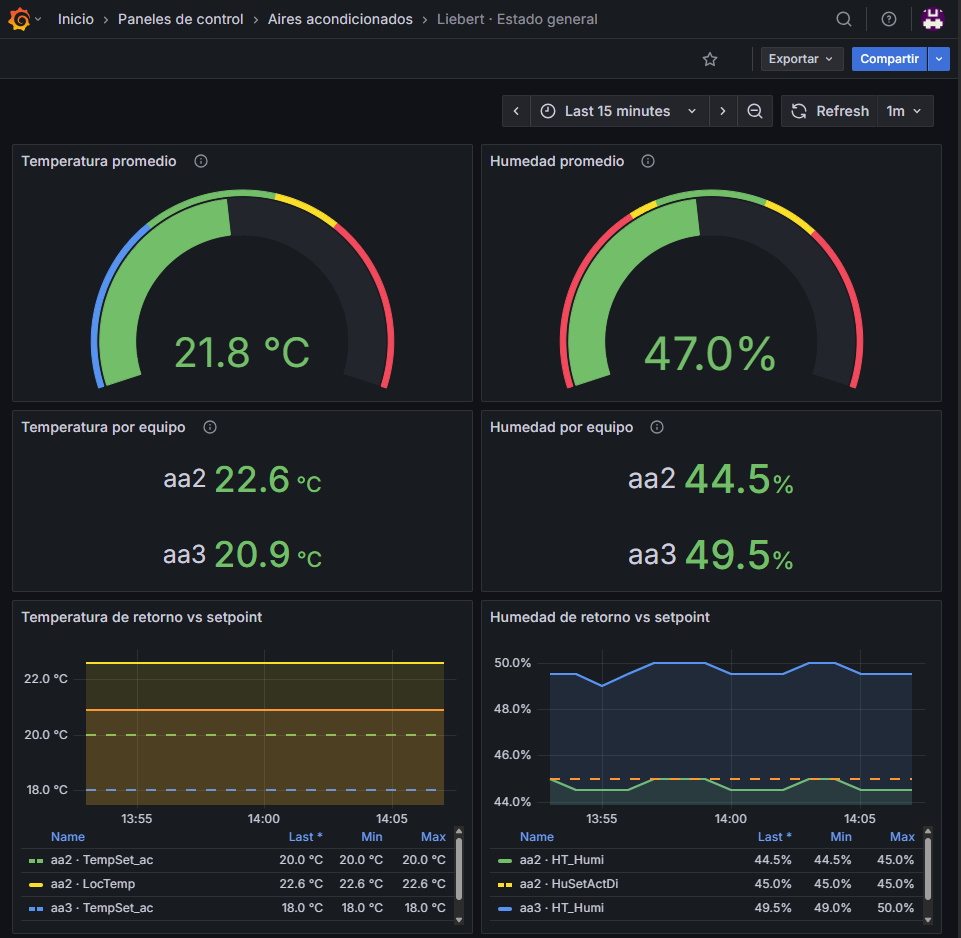

# Monitoreo Liebert / Emerson

Stack de monitoreo con Telegraf, InfluxDB 2 y Grafana. Puede recolectar desde
snapshots XML de prueba o desde unidades Liebert reales por HTTP.



## Levantar el stack

Crear primero el archivo local de configuración a partir del ejemplo:

```bash
cp .env.example .env
```

Editar `.env` y reemplazar todas las credenciales de muestra. Luego levantar los
servicios:

```powershell
docker compose up -d
```

Abrir Grafana en <http://localhost:3000>.

- Usuario y contraseña: los valores `GRAFANA_ADMIN_USER` y
  `GRAFANA_ADMIN_PASSWORD` configurados en `.env`.
- Dashboard: **Aires acondicionados / Liebert · Estado general**

InfluxDB queda disponible en <http://localhost:8086> con las credenciales
configuradas en `.env`.

Si Grafana se publica detrás de un proxy reverso o con un dominio propio,
configurar en `.env`:

```dotenv
GRAFANA_DOMAIN=grafana.example.com
GRAFANA_ROOT_URL=https://grafana.example.com
GRAFANA_LIVE_ALLOWED_ORIGINS=https://grafana.example.com
```

## Verificar y detener

```powershell
docker compose ps
docker compose logs -f telegraf
docker compose down
```

Los volúmenes conservan el histórico entre reinicios. Para borrar toda la base,
el histórico y la configuración persistente, y empezar de cero:

```powershell
docker compose down -v
```

## Modo simulación y modo real

El modo se elige en `.env`:

```dotenv
MONITORING_MODE=simulation
```

- `simulation`: Telegraf relee `datasets/aa1.txt`, `aa2.txt` y `aa3.txt` cada
  10 segundos. Es el valor predeterminado.
- `real`: Telegraf consulta por HTTP las tres direcciones configuradas:

```dotenv
MONITORING_MODE=real
LIEBERT_AA1_IP=192.168.60.1
LIEBERT_AA2_IP=192.168.60.2
LIEBERT_AA3_IP=192.168.60.3
```

Después de cambiar el modo o las IP, recrear solamente Telegraf:

```powershell
docker compose up -d --force-recreate telegraf
docker compose logs -f telegraf
```

No es necesario recrear InfluxDB ni Grafana. El modo `real` requiere que el host
de Docker tenga acceso de red a las IP configuradas. Las credenciales de
`.env.example` son exclusivamente demostrativas y nunca deben usarse en
producción.

> InfluxDB utiliza las variables `DOCKER_INFLUXDB_INIT_*` solamente durante la
> creación inicial del volumen. Cambiar `.env` no modifica las credenciales de
> un volumen que ya fue inicializado.

## API de consulta

El servicio `api` es opcional: está en el profile `api`, así que
`docker compose up -d` no lo levanta. Para activarlo:

```powershell
docker compose --profile api up -d --build
```

Para apagarlo sin tocar el resto: `docker compose stop api`.

El servicio `api` (FastAPI, puerto `API_PORT`, 8000 por defecto) publica el
último valor y el historial de `aa1`, `aa2`, `aa3` y `system` leyendo de
InfluxDB. Si `API_KEY` está definida en `.env`, hay que enviarla en el header
`X-API-Key`. Documentación interactiva en `/docs`.

| Endpoint | Descripción |
|---|---|
| `GET /health` | Estado del servicio (sin clave) |
| `GET /api/equipos` | Lista de equipos |
| `GET /api/data` | Último valor de todos los equipos |
| `GET /api/equipos/{equipo}` | Último valor de un equipo |
| `GET /api/equipos/{equipo}/history?item=LocTemp&range=3h&every=1m` | Serie de un ítem (media por ventana) |

```bash
curl -H "X-API-Key: $API_KEY" http://localhost:8000/api/equipos/aa1
```

`online` es `false` si el equipo no reportó en los últimos 10 minutos.

### Equipo `system` (192.168.6.4)

Responde, pero con la página "The Web Interface is disabled": el iCOM tiene
apagado el *Simple Monitoring* (el XML que sí publican aa1-aa3), por eso no
entrega datos. Hay que habilitarlo en el controlador (parámetro `Son` / Simple
Monitoring = yes, con clave de nivel 3 desde el display o con el iCOM Service
Tool). Mientras tanto la entrada de `system` está comentada en
`telegraf/telegraf.conf` (descomentarla después de habilitarlo) y `system`
figura `online: false`.
